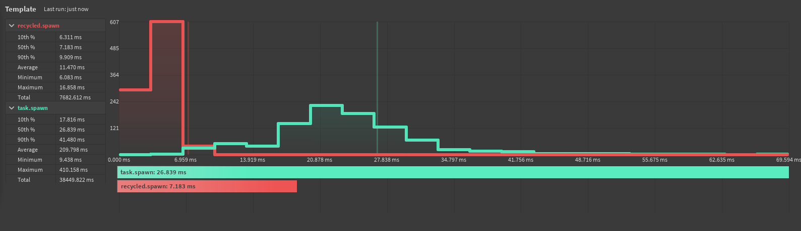
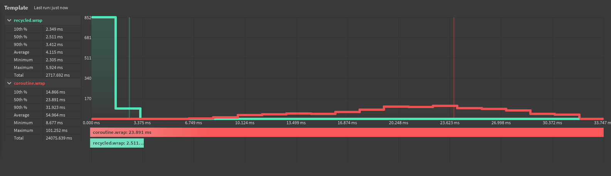

import { Bleed, Table, Callout } from 'nextra/components' 

# ThreadRecycler

An efficient thread management module written in Luau for Roblox. (Strictly typed) (Additionally my first public module)

## Performance

ThreadRecycler optimizes thread usage by recycling and reusing it in a thread pool, reducing resource consumption. Fewer resources are wasted on unnecessary threads, leading to faster execution. While ThreadRecycler helps optimize thread usage, it may depend the number of active threads.

## Limitations
* Must replace `task.wait()` with `ThreadRecycler.wait()` to prevent issues in the task library. (more context in the API reference)
* Risky to use `task.defer()` and `task.delay()` due to task library issues; must use an alternative. 
* Module may be in needs of major improvements...

## Benchmarks

* Specs: Intel Core i7-9850H @ 2.60GHz; 64 GB RAM; dGPU: NVIDIA Quadro RTX 4000; Mobile Workstation

<Callout type="info">
Only `spawn` and `wrap` are compared, as using `task.defer` is considered "unsafe" in this module. `delay` cannot be benchmarked as there cannot be yielding. 
</Callout>

**task.spawn vs ThreadPool.spawn**

**coroutine.wrap vs ThreadPool.wrap**

<Callout type="info">
These benchmarks were created using Benchmarker. If you have Benchmarker, you can try it out yourself by using the bench file in the GitHub repository. /root/benchmarks
</Callout>

