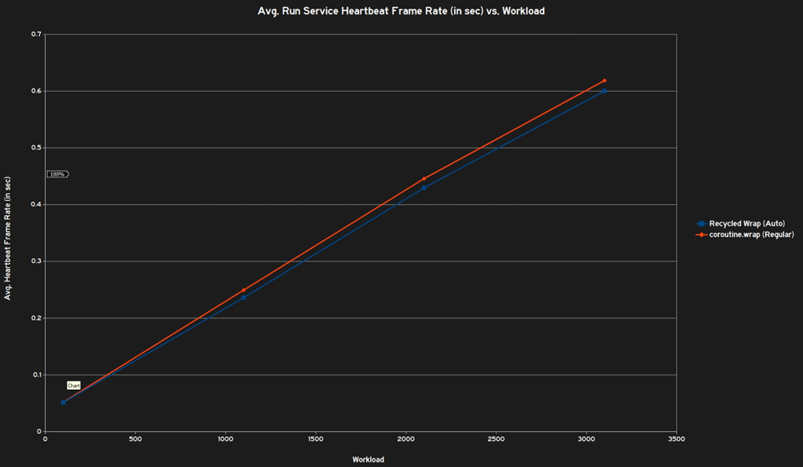

import { Bleed } from 'nextra/components' 
import { Table, Thead, Tbody, Tr, Th, Td } from '@components/ui/table';

# ThreadRecycler

An efficient thread management module written in Luau for Roblox.

## Performance

ThreadRecycler optimizes thread usage by recycling and reusing it, reducing resource consumption. 

Fewer resources are wasted on unnecessary threads, leading to faster execution.

While ThreadRecycler helps optimize thread usage, it may depend the number of active threads. However, it should never lead to a decrease in performance.

## Limitations
* Must replace `task.wait()` with `ThreadRecycler.wait()` to prevent issues in the task library. 
* Risky to use `task.defer()` and `task.delay()` due to task library issues; must use an alternative. 

## Benchmarks

* Compares Heartbeat to workload. What is specifically used for workload in this case is remote events, property changes, and calulations. 
  * A heartbeat is usually 1/60th of a second; around 0.0167. Larger number = slower. 

<Callout type="note">
This doesn't measure in FPS (e.g 60 fps), it uses ms instead. 60 FPS -> 1/60
</Callout>

<Callout type="info">
  Positive: Recycling takes longer than regular use.
  Negative: Recycling is faster than regular use.
</Callout>

<Table>
  <Thead>
    <Tr>
      <Th>Workload</Th>
      <Th>Method</Th>
      <Th>Manual Recycling</Th>
      <Th>Auto Recycling</Th>
      <Th>Regular Use</Th>
      <Th>Difference (Manual - Regular)</Th>
      <Th>Difference (Auto - Regular)</Th>
    </Tr>
  </Thead>
  <Tbody>
    <Tr>
      <Td rowspan="4">100</Td>
      <Td>Recycled Spawn</Td>
      <Td>0.050934</Td>
      <Td>0.051028</Td>
      <Td>0.052784</Td>
      <Td>-0.001850</Td>
      <Td>-0.001756</Td>
    </Tr>
    <Tr>
      <Td>Recycled Defer</Td>
      <Td>0.016645</Td>
      <Td>0.016761</Td>
      <Td>0.052784</Td>
      <Td>-0.036139</Td>
      <Td>-0.036023</Td>
    </Tr>
    <Tr>
      <Td>Recycled Bad Defer</Td>
      <Td>0.051750</Td>
      <Td>0.051310</Td>
      <Td>0.052784</Td>
      <Td>-0.001034</Td>
      <Td>-0.001474</Td>
    </Tr>
    <Tr>
      <Td>Recycled Wrap</Td>
      <Td>0.051318</Td>
      <Td>0.051484</Td>
      <Td>0.052118</Td>
      <Td>-0.000800</Td>
      <Td>-0.000634</Td>
    </Tr>
  </Tbody>
  <Tbody>
    <Tr>
      <Td rowspan="4">1100</Td>
      <Td>Recycled Spawn</Td>
      <Td>0.251524</Td>
      <Td>0.246071</Td>
      <Td>0.243614</Td>
      <Td>+0.007910</Td>
      <Td>+0.002457</Td>
    </Tr>
    <Tr>
      <Td>Recycled Defer</Td>
      <Td>0.016871</Td>
      <Td>0.016805</Td>
      <Td>0.238632</Td>
      <Td>-0.221761</Td>
      <Td>-0.221827</Td>
    </Tr>
    <Tr>
      <Td>Recycled Bad Defer</Td>
      <Td>0.245513</Td>
      <Td>0.241942</Td>
      <Td>0.238632</Td>
      <Td>+0.006881</Td>
      <Td>+0.003310</Td>
    </Tr>
    <Tr>
      <Td>Recycled Wrap</Td>
      <Td>0.244087</Td>
      <Td>0.236169</Td>
      <Td>0.249500</Td>
      <Td>-0.005413</Td>
      <Td>-0.013331</Td>
    </Tr>
  </Tbody>
  <Tbody>
    <Tr>
      <Td rowspan="4">2100</Td>
      <Td>Recycled Spawn</Td>
      <Td>0.433967</Td>
      <Td>0.427168</Td>
      <Td>0.435914</Td>
      <Td>-0.001947</Td>
      <Td>-0.008746</Td>
    </Tr>
    <Tr>
      <Td>Recycled Defer</Td>
      <Td>0.016987</Td>
      <Td>0.018037</Td>
      <Td>0.428708</Td>
      <Td>-0.411721</Td>
      <Td>-0.410671</Td>
    </Tr>
    <Tr>
      <Td>Recycled Bad Defer</Td>
      <Td>0.253181</Td>
      <Td>0.225600</Td>
      <Td>0.428708</Td>
      <Td>-0.175527</Td>
      <Td>-0.203108</Td>
    </Tr>
    <Tr>
      <Td>Recycled Wrap</Td>
      <Td>0.419219</Td>
      <Td>0.429620</Td>
      <Td>0.445877</Td>
      <Td>-0.026658</Td>
      <Td>-0.016257</Td>
    </Tr>
  </Tbody>
  <Tbody>
    <Tr>
      <Td rowspan="4">3100</Td>
      <Td>Recycled Spawn</Td>
      <Td>0.620988</Td>
      <Td>0.603288</Td>
      <Td>0.604013</Td>
      <Td>+0.016975</Td>
      <Td>-0.000725</Td>
    </Tr>
    <Tr>
      <Td>Recycled Defer</Td>
      <Td>0.018562</Td>
      <Td>0.020192</Td>
      <Td>0.616689</Td>
      <Td>-0.598127</Td>
      <Td>-0.596497</Td>
    </Tr>
    <Tr>
      <Td>Recycled Bad Defer</Td>
      <Td>0.616978</Td>
      <Td>0.607503</Td>
      <Td>0.616689</Td>
      <Td>+0.000289</Td>
      <Td>-0.009186</Td>
    </Tr>
    <Tr>
      <Td>Recycled Wrap</Td>
      <Td>0.614544</Td>
      <Td>0.600208</Td>
      <Td>0.618695</Td>
      <Td>-0.004151</Td>
      <Td>-0.018487</Td>
    </Tr>
  </Tbody>
</Table>

<Callout type="info">
Benchmark Roblox place is in the GitHub respiratory. /root/benchmarks
</Callout>

<Table>
  <Thead>
    <Tr className="bg-gray-800 text-white">
      <Th>Workload</Th>
      <Th>Method</Th>
      <Th>Manual Recycling</Th>
      <Th>Auto Recycling</Th>
      <Th>Regular Use</Th>
      <Th>Difference (Manual - Regular)</Th>
      <Th>Difference (Auto - Regular)</Th>
    </Tr>
  </Thead>
  <Tbody>
    {[
      { workload: 100, method: "Recycled Spawn", manual: 0.050934, auto: 0.051028, regular: 0.052784 },
      { workload: 100, method: "Recycled Defer", manual: 0.016645, auto: 0.016761, regular: 0.052784 },
      { workload: 100, method: "Recycled Bad Defer", manual: 0.051750, auto: 0.051310, regular: 0.052784 },
      { workload: 100, method: "Recycled Wrap", manual: 0.051318, auto: 0.051484, regular: 0.052118 },
      { workload: 1100, method: "Recycled Spawn", manual: 0.251524, auto: 0.246071, regular: 0.243614 },
      { workload: 1100, method: "Recycled Defer", manual: 0.016871, auto: 0.016805, regular: 0.238632 },
      { workload: 1100, method: "Recycled Bad Defer", manual: 0.245513, auto: 0.241942, regular: 0.238632 },
      { workload: 1100, method: "Recycled Wrap", manual: 0.244087, auto: 0.236169, regular: 0.249500 },
      { workload: 2100, method: "Recycled Spawn", manual: 0.433967, auto: 0.427168, regular: 0.435914 },
      { workload: 2100, method: "Recycled Defer", manual: 0.016987, auto: 0.018037, regular: 0.428708 },
      { workload: 2100, method: "Recycled Bad Defer", manual: 0.253181, auto: 0.225600, regular: 0.428708 },
      { workload: 2100, method: "Recycled Wrap", manual: 0.419219, auto: 0.429620, regular: 0.445877 },
      { workload: 3100, method: "Recycled Spawn", manual: 0.620988, auto: 0.603288, regular: 0.604013 },
      { workload: 3100, method: "Recycled Defer", manual: 0.018562, auto: 0.020192, regular: 0.616689 },
      { workload: 3100, method: "Recycled Bad Defer", manual: 0.616978, auto: 0.607503, regular: 0.616689 },
      { workload: 3100, method: "Recycled Wrap", manual: 0.614544, auto: 0.600208, regular: 0.618695 },
    ].map(({ workload, method, manual, auto, regular }) => {
      const diffManual = (manual - regular).toFixed(6);
      const diffAuto = (auto - regular).toFixed(6);

      return (
        <Tr key={`${workload}-${method}`}>
          <Td>{workload}</Td>
          <Td>{method}</Td>
          <Td>{manual.toFixed(6)}</Td>
          <Td>{auto.toFixed(6)}</Td>
          <Td>{regular.toFixed(6)}</Td>
          <Td className={diffManual < 0 ? "text-green-500" : diffManual > 0 ? "text-red-500" : ""}>
            {diffManual}
          </Td>
          <Td className={diffAuto < 0 ? "text-green-500" : diffAuto > 0 ? "text-red-500" : ""}>
            {diffAuto}
          </Td>
        </Tr>
      );
    })}
  </Tbody>
</Table>

